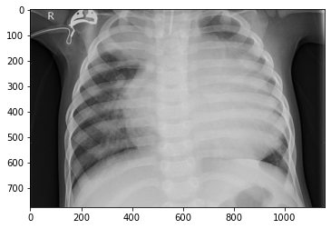
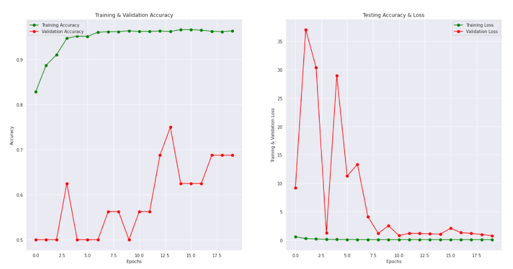
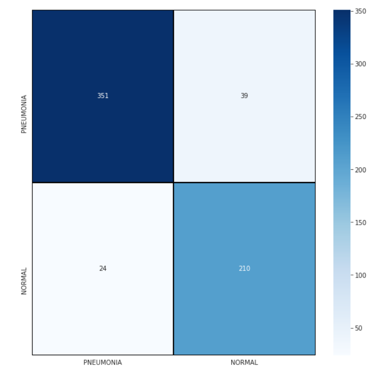

### Qu'est-ce que la Pneumonie
La pneumonie est une affection inflammatoire du poumon affectant principalement les petits sacs d'air connus sous le nom d'alvéoles. Les symptômes incluent généralement une combinaison de toux productive ou sèche, de douleurs thoraciques, de fièvre et de difficultés respiratoires. La gravité de la condition est variable. La pneumonie est généralement causée par une infection virale ou bactérienne, et plus rarement par d'autres micro-organismes, certains médicaments ou des affections telles que les maladies auto-immunes. Les facteurs de risque incluent la fibrose kystique, la broncho-pneumopathie chronique obstructive (BPCO), l'asthme, le diabète, l'insuffisance cardiaque, un historique de tabagisme, une capacité réduite à tousser, comme après un AVC, et un système immunitaire affaibli. Le diagnostic est souvent basé sur les symptômes et l'examen physique. Une radiographie pulmonaire, des analyses sanguines et une culture des crachats peuvent aider à confirmer le diagnostic. La maladie peut être classée en fonction de l'endroit où elle a été contractée, comme la pneumonie communautaire ou nosocomiale, ou associée aux soins de santé.
 

![](data:image/jpeg;base64,/9j/4AAQSkZJRgABAQAAAQABAAD/2wCEAAoHCBUVFBcVFRUXGBcYGhcbGxoaGh4dGhsaHRoaGxoaHBgbICwkGx0pIBsbJTYlKy4wMzMzGiI5PjkzPSwyMzABCwsLEA4QHhISHTIpIikyMjI0MjI8MjIyMDIyNDIyMjM7MjIyMDIyOzIyMjIyMjIyMjIyMjIyMjIyMjQyMjIyMv/AABEIAMABBgMBIgACEQEDEQH/xAAbAAACAwEBAQAAAAAAAAAAAAAABAMFBgIBB//EAD0QAAEDAgMFBgQDBwQDAQAAAAEAAhEDIQQSMQVBUWFxBhMiMoGRobHB8EJi0RQVI1JyouEzgpLxBySyFv/EABoBAQADAQEBAAAAAAAAAAAAAAABAgMEBQb/xAAqEQADAAICAQIFAwUAAAAAAAAAAQIDESExBBJBIjJRYXETgcEFFJGx8P/aAAwDAQACEQMRAD8A+zIQhACEIQAhCEAIQhACEIQAhCEBRdsj/wClWsTZtgYLvG3wgyInTUaqhpNr0HPqUMMcMx7sNRbTrPDwXvrZX1clKo4Nhjho4F0X0BWyxmFZVYWPEtdEiSNCCLi+oCMVhW1A0OEhrmPFyPExwc024ECyAyGI7R4ppbRAaajTiM724erUa7unsY0ClTeXU82cS4uIGWwM2fodoajmOeWBh/aMHTyOBzNbWZh3ODr+cGq4egsrDF9nsPUu5jgZe7MypUY7+JHeNLmOByOytlsx4RawQ/s7hjUFTuyHNNMhrXvbTzU47t3dtcGFzQAASJgRogM4/tBju77wHDQcNVxIHdvkCk5oNMnvbl4cDmtlg2crA7axGbvf4fcGsaAZld3gIlveZ80EZx5cvlvM2Vx+5KGTJ3fh7p9GMzv9N8ZmzM3yi+vNcfuDD9732R2bWM78mbLkz91myd5ltmiY3oDOU9tYhzKRrii7vRgKrAxr25O9xFNjmk94c5GYEOsJFwQndi7fq1cUKTix9N7Kz2uZSqMa3u302gNqvOWuCKl3NAEttra5/cdCKbclqbaTWeJ1m0ntfTGt4cxpvrF5UeA7P4ei9r6bHBzWvayalRwY15BcxjXOIYyWt8IAAgQgLhCEIAQhCAEIQgBCEIAQhCAEIQgBCEIAQhCAEIQgBCEIAQhCAjqvytJ4BUR2tUZUYHtzU3kNLmi9Nx0LgPwHjuR2qxr6TGFjcwDgXj8sEX4C+u6AutjVWV2525o3yIjlOhPRE+SXDa2XwXq8AXqEAhCEAIQhACEIQAhCEAIQhAJYjaFNjmsc7xuBIaNYGpjgmmukSN6oKmBDKlSpBL3kZnEzYWaBwbyG+U7sfHNqZ2AyaZAPrf4XCl69gpetstUIQoAIQhACEIQAhCEAIQhACEIQHijdVaNSu1gf/IFXF/wqeH70Nc55e6nmzSC3I0uZdrYJPOOSmVt6K1SmXT9jV4zbNGk4NfUpMLvLneG5uYB1HNP0qmYSvj+K2PXrEVKlOqX5QHOLCScohtugHrJWg2JtzE0e6oVMLV7sZaZqNDyWiYa4jLBAsOgWlY9LaezHH5Ct6ctfRn0SVW7U2xTo5Q43cY5DmSqjaDsR39MgPfTEhzWcb3I00IN+Cb2jsxr6cVGiCRAHmB4zuKx2dfpSfI1RplzpJubzwC42ptEYfu2hlnOOaAfCyzS85RaHuZJMCCbqPZ+EGGoPLA55aCQDdxDROVoA11gDekDtLGPLT3OTwuzNcxzwXNIBGYAQ0w+OILT1EV2T/wD6xgyhzHyQ7NEQHNAJEk6eJpng4J3ZG1+/fVGWAzLGh1F/EDBuDpaIO9JYrF1mVXHuy+nEMaKZOV3dg+ZoJMuJad0dEzsPFVHl3eMLAGU4BYW3moD4iAHSAwwLDMApKl4hCEB4qva+0X0suSkahM6OAj6lWiotu4kse0AAyDa86/lDj/b6oWlbZPsjadSrIfRNMgSPECD6WIVsqPZOILngEAeAmLzq3+YNI/4+qvEFLTPUIQhUEIQgENq4AVmFmZzDuLTHoeI5Kq2TgG4SQ0Ez5ydTw9BuWjVZtova3NTYHu0ykxIOh5wd3NRotLfRYU6gcJBkLtZLYVGswvqVXQ95Hh/CI6W4W3AKybt0Ct3Lm3y5szTI0mCN1r67wmw554LtcPeBqQOqX/ap8vqSPouJJknX7hGyVDfY6HSvUi1xBMGPTemKNSddRr+qJkVLROhCFJUEIQgBCEIDkpFgvfh8d6fUL6IN7joqtbJTK+u5RUqWYgz/AN7lPWwhJvm9Lg/oUxTwp3mJ1gX6Suf9Kne30bKlKJsOPCOYn3uqvtDtAUhTLmktLjJG4gCNepVs54aANOA/wk6wDyDuExz6z0XSzOVt7JNl1c9Jj4IzSQDrBJifSE4k6VbKMpkxoQN3PmmmPBEhERSaZ2hCFJU8QuH1ANVH+0ckJUtk6znafzU5iCHakRu3OcAfYrQMqA6Kh7TWNM3FnSZI/l1OZo93eh3Qy0dnOwD47RGQ6RGrdzTA/wCIWjWc2EZeLz4DeZGrd+Z4+I6HdoS6NUQydnSEucRyXTawOtvvipI9LJ0LxeoVPFBivIeV/YypKj4ErPbX7RUaJcx72mqGOeKY8zoBIHCTFpT8Er6ss8A4S5p5HqvGbHpNe57G5XO1I/Q6eiw+x+3T3OecSxtNgGZjmBzspmA0i5dM6iOi2uy9qMrMbUpvD6btCLEHSCN17QbhTUOe0ROSb5hkgYWkixGs6RbgpF1VaQSYJB4cdPoow6+8dbKjN5e0ehS4QebjPw3fNRNBJgRz5FNUqcDnvRFbfGiVCEKxkCEIQAhCEAIQhACEIQCNU+Iz6dP+5Xi6q+czyjpH6yuZVGbz0Clwv4ju+o1Py9lCXAFMYYEAk2k/QKURfROoKtaLD3XGIrxPAan6KorbRaCoqkicWGr9iwL14HJGljWuI5pxhUJ7NqxueGidjoIP3G9VnaUXpkTPj0Bn8O8NJHuFYBV/aUS2n1NoB3Ddld8G+oVl0YUviRxsSe8BMzkNzPFu9wn+49Fc4l149VS7CEVNIOQ7o3t3ZWE+x9N9tiD4j6fIJ7DW7Iy9AcoyUNcqm+hqlXjXT4hNNINwqwuQzEFp5bx+nNSqMqxb5Q9ivLzkR1Xyfavct2jVeKjjUkWLRlY/I0AZibtFt3JfWKniaCL6ELI7T7G0auI/aD3jHEgva2MriIAJkW0Ewd3qtsdKa2zlyxVTqdb37mUxFNwp1O9acg1Fgc98u7r6LT/+O6TBhgabXAOqvLsxmXCGgggDw+FtuRSWy+xtRtVzq9VlWmQ4BgBl86F0+WNbE6a2W4wOAbTaGta1rW+VrRACvlyKuEZeNhePl/Rr7jNaq1jXOcYa0Ek8ABJKhdiqRkOczwzOYgRESb7ri/NS4rDiox9N3le1zTGsOBB+azGN2dhG1suZ9N7i0ZWNAa2cxDh4YAuQY/nusTcvae06Gbu21GBwzeGY8ph2tvuU8HA6X+4WNbTwTWODKjnlrIDSJF3NcJIYIBc1rJsJtqtNsgNFCmGkkBoEnVxFi48yZJ6oB9CEIAQhCAEIQgBCEIAQhCAjfTB1UJww/CY+MplCaJTaIaVLLeZP3ois+BzP3KmVZjq8An26KG9Ivjl3RU7YxwAICy1bGGSJujbWMl0T1VK6qQSB7n4rgyZNs+t8Pw1MI0mzsUbzOq0uAxGYLA4SrMAai9lr9i1ZV8VnN5+BJNmgplV/aOoMjAb7yNbQBJBMRJFyDrpvT9JUNOlUrOsTLvxCwAuJn8JGkXO4tMArqR4FrnY5sTw1GtIyyx0CABq3cI5/h3G6tcSfEfvcFnqWAfhoB8XMCM0GYEeXdmc4iwgAK2w9YvZmN+fGAPFHA3I5Qj6IlfFs8e9dNdLTE/cb1E933ZeUn6k6adVXZ1OeCdpXLxC4z8hHEE/X5Icbxu+9UISexjZ2Ig5DodOvBWqzr2xffZXmErZmB3K/XerS/Y5/IjT9S9yQMAuAB6KRCFc5gVbW2PRe5z3MlzwQ6S6CC3KbTAlsCRwVkhAVjti0CSe71MkZnAazGUGImDGkgHVPUKLWNDWiANB8VKhACEIQAhCEAIQhACrts411Gn3jW5oN28RBJA4G2qsUIDKO7R1Gvdnpty5wxrQ4zIALzmLYdeYECQNxsp2doKhgdwJOSP4hiH8T3diJbbrwvpEIDJjtWS61NobDZLnkAF2gc7J4Yh02NoIVns7a7qrw00iyWucCTPhDiyHCBD5HlvY6q5UXdNkugZiACd5AJIE8JJ90BFWr+E+F3DRZ7bWJhujoHJaLEnT1P37rLbbcSDfTXossr4O7wo3aMRj6hL3eF1ov+E6795/UJSRMTpy3/VWWLjMARYGJ3qAYNxNmkidR96Lz6W3wfZY7UwtkmzmX+v6Ld7Fw8NktHI7927oZVTsXZIYMz/vkOevQwtD3tyGiw+5jcunFj9K2zwf6h5X6teiP8j24qXA4NtNsDU3J3k8SdT6pajf1VoF1SeFl44IMRh2vaWuAIO4iehvvSVKhkBaTNyRrob3klWiQxgv6BKIx96FazBEhoJ5k/L71ST3zr/1yhMOqkcSPjyuuarGv0IBt/i3D5BpJVHz0dkNz319SNrwNfUIcb8Y38RqD7KFtN0xlJ6D4qR9QNItJAE3tYKv5NmlvjkkeD+vWJKb2NU8zfUfI/RJC0kG3xmRu6KXA1IqNHUH1H6wrS9MyyLcNGgQvF6tTzgQhCAEIQgBCEIAQhCAEJPaeKNOk97RJaLA7zIH1VNhu04IIfTdmDsnhLfNlsDmIuXBw3gRcxdAaVCzZ7V0mgl7HiHOBjKYAi9nXHiaMwlsyJsp6HaJjjUGSoO6bUc6zSP4ZGZocHZSbjfF9yAvUKt2XtA1jUOXK1j8gkgkkNaXTlJFi6PSd6skAIQuHugEoBTFvv0H39Fm9qizum7qrvEOJVXi/FDQJm3HoscnJ6fi/A0zM1KBddoN9SBMHnw6qx2dgO7Be8yN8fTjw9wYTWHwge/Tws3bvbnr8FJUqhxJNxuAG4HU/c21WUwlyd+TyKv4J69z3K4ug7jA4cteUJ6kLnqfbVQtE5TPiygmemvtuTdMe24clokcVVwOYcXHUKxSGFFx6/Ip9az0edlfxAlcaNOh+iaSe0XwGndmAPQg/4UvoiPmRV1t/RJVg5rpHAfIAhWVUEaff6JGu0Hfc6fp7/NYs9LGyRtYvbl0M3vqb7t839eAC4LCLPuALuGgGvm37rJJtXL16WMTIKaxLjDajZg2M6X4/EfQCE9W0T6HFaXT6/Id7LT/VIB3C/wCo9lJTqw4HgQfYqBpg6WNx0iY9rSvcm8XHx9Qo2yzmejVgrpIbLrZmRvbb03J9bp7PJqXNNM9QhCkqCEKCjiGPuxzXWBsZsZg23GD7FAToXkrim8OEggiSLcQYI9CCEBIhCEBRbcxdVrmNYwVGFr3PaQTmDWklsgECbAcyEn+3vNNj/wBma053MLCwklhpzlEN8JJAZwlt+C1Kgr4hrBLnBo3SYnkOJQGaOOqOgHCsJgTAeC1pYXkB2TzHyiDYgzeyjw2LfTZLMMMoY0BrWvzyXOc5hc9kuFyDzJhX42rT/P6U3x75VPh8bTfZrwTw0P8AxN1GyXLXaKTZm06hqtpdxlpuc4BwaWtDWsEFoi4JG/c4DdfSoQpIPErin7vU/RNKuruuTzUPo0xrdCOIekq7rSSQdTAEwee6UzWMFR9yXGSYv7rF8noy1K2RYghtMZZBeZMxOgnpu+4UDWEmW6uMRzn4JnHNDsh3XFvT21+C9otjLGt/iLE+gmFDXJeK1O/d7JGu8RAvpBPICE1SnePvooWCOR0t9+iYptVkY1ocwo8XofonUnhh4vQ/MJxaz0cGT5gVftn/AEj1HzVgq/bf+i7/AG//AEFFdMnD88/kr8PiM7eYsfoVBiDa4/wqxmJcwy0/oU7hcaHnK4Q7dwMLBUnwetWFw/UlwQVGSTOgU+DqB2ZjtC0GOFhoTp/jeun0pJB4EDgfsx7pWj4ajYkmf8G4RcMmvjlr3S4JGkEuEm1gHAWOmUEzFrL1tUnWRx69F1XZml7YIN8vtMD7KgdUk31+P6o+CI01v/kWezq+V4O4+E/RaJZJpGnv1+7LS4KpmY074v1Fitcb9jh8uNNUhlCELQ4xTE46nTc1tR7Wl+bLmIAOWJEnf4gst+6cMYDMWyCGNAlpg6k0yHDK5xknXzvH4raTaGzmVsucugTYGJBLTB9WtPp1VXXwmEzOzOc+ZaQ0ufAL85b4AY8cm97ndEAVlTZmEeKjadek2ZDoawjIXF8eYS0AtbI0LG8Fodj1qTWikyq17hmOolwLi7MBNxfXkq84fDOgufUzAlwe8OacxDBmlzQ23dtjdZPbP2NQY8VWSTlgGQQdbzGtzoYv0QnWi4QhCEFdtDGFsMZBe699Gt/mPHgBvPQqlrV2sJPnf+JzjfoTuH5RAC7rYjwuqb6jrH8twz+0T1JWbxtd0ltot14rDJej1vD8RXyy3dtbxBstk8re8qdmMa/wuAtvB0O48WnmFjji2B2Wb74Egeqbw1eCHC8j5rPdTy1wdv8Ab4cm5lptG8wWMc1wZUMh3ldvn+V3ONDv011t1kNn1O8ZlNjAIO8cCOhghafA1s9NjjYkCRwO8ehldEVtHieTi/TrRM8wCUg8WTtbynokqimimIUc4+iVAIBdJkiB03p132FDVMuB4W/VUZ2S/sQU2hzCDuIidLiPZetou3/JdtZAnjFvvoFNk0M2IH6KNFnWnwcsZYcfomGCFyxmiYaFZIyqiXDeb0P0TaUoeb0KbV0cmTsFV9oHRQd1b/8AQVmqXtW6MOf6m/NRfysv463llfdGUe9Rd6QQRqDIS5qqN1RcTZ9QoNjSfnaCL5goalPLJ/FHsDaTzSfZ+vmZlnyn4aqzeCZO/ot09rZ5VpxbkSDXFpaJlvibHA6j6r1ld8Az1tv69IU2YtlwERaPyyL/AAI9V44iT+EG9hYyLGNyDe30dUyDewO+3GwPv81c7HfLCOBP0P1VGCZtpHv6brq32I+Q7qPr+itD5OfyZ+Bstlw94AJJgASSdAN67VXtmpZtP+cku/pbcj1cWg8iVseelsVqVHVzvDNzdMw4v5H+T3nQd4g0qNMvqODGNFybADdAHwASfaDHvw2EqVabWue3LZ05Zc5rSTBBMTpK+SY7EPr1X1qgGd5kxoLQAJJMAc1pjxO+fYx8jypw8a5PtGGdTqsa+m4OY/yuB199/JRuoupnPTMcR+B39Q3H8wv10XyGix1hJEGRfQ8RwK+qdntrnFMeXU8paWgw6QZBPC2nxVsmBwvV7FPH82MtelrT/wBmgweKa9gcLbiDqCNWnmEKrw9YUqrsxhrhf+ppAB6lp/tCFhs6nJWVGnuafJrB65YWadqZM31+q2eKoQ59M2Dpew9TLh1a46cHBZzH4EgkgAEDSNeYXLll9nveDllzp+53svs+DDoEGDyuoNrYGnSflYdfERaAdI62Vpsik79nqAOLS4ktuQQRBEdSqPD0XVCb31JNySfqudZaumt/sZeH40481Xvr+S37PtdJnSLe4Wq2P/pDm6oR0L3EfAhUmFw5YxrB53w0crank0ST7cFpqFIMa1o0aAB0AgLuxzpHF52RXfB5iPL7fMJRwTeI09QlVdnPj6IXqMUt/wD2mCEBqqbqtCzaY9FLk4qWF02mdwP31TRV2Rhq7AUgou5e67bQ4n2U6KPIjzDtvPCyZXLWwIC7VkYU9vZ4qvtBhTVw72t80SOZaQ4D1iPVWi8KNbWiZpzSpex8d75eGqvoG1uyVGsS4F1N5uS2IJ4kG09IVFW7CVR5azXdWkfEErjrDS65PpcP9SwUvien9xDs/i8tQjjC1ZEi0zvWTqdl8ZSIc1jXR/K4H4OglX+zMSSA2o1zHjVrgWnq2fMOitj2uGjDy6x2/XFJ/gcdR/EDEb/oPX5qJ3itFxpbUb7AC+/3TxZr6KEiL8Fo0cc0LRujT3VnsQ3d0H1VdVHARx/wnNiHxkcvqFM/MRn5xsvlT7WH8WmfyVB65qZ+h9lcJHatAuaC0S5hzAcbEOb1LSY5wtjzZfJjf/I7HGlRio4NLyCweV9pDjzEWH5ljaez3N8wg2twkSPVfV2hlWmWG7XNI9CIBE7x9FmcV2eqsdFP+IwePM4gEkC7Tz/wuvx8spaZ53nePVV65W/4M7h8GwiXS0bnASJ4EK97H4SoKpex38MSH8HW8IjeZg8lBh9lV3ObFNzadUyTEhom5I/Da91rdm7OZhqbmtLnZnTfjEQANFfPllS5T7Ofw/FusiprSX7Ce36bnjKzXMD6BsH4kL1WmyqeZ7qp0gsbzuC93SQAP6TxQvP0e56tDuLwwe2DNrgjVp3Ec/gdDZVNfDPFqjMwGj2An3YPE09JHNaBClymRGSo6Mk+lS07wt5TB9iExhaGgpU3HdmdLWj/AHOEn/aCtKvIWU4Yltpcs1fk00JYLBZJLjmeRBOgA/laNw+J37k8hC2MG23tkVZsiyXyngfYp1CholU0JtpOO6Ov+FKKHE/Rd1nZWucNQCfYLLnb2JYzM+k27KZacpBl5tma17gAYeJzahv80BpB02aprANAF2smO0b+7JDqbqhY1zB4fEZqZwAyo8ENDGkw6wdeEU+0VRznWYwA+AOBzVCAwOptuIfnL41sG21UlTWIWQpdo6xaB3Q7w02kNAcQ57shBbFyzI8utcQRuK1GGrh7Gvbo5ocOhEoCdCEIAQhCAELxZSn2jqF9IPa2k17GOcX5LyGEls1RDTmMC7reVAatcPpgiCARwIkLM0u0TnU6gOSnVax72Me0guiXtAYXAu/hlsxvk6KWttmu1zm92Hd2Kji6zRUDDSBDBnJaf4jvMIsL70BeHCN3W6aeyUr4AnQg/BL4na3duLajqYc0UC68eF78lR4BMho1ndvVcO0dWSC1jQ4tLXw4sDC2jmc68DL3mbUAgi4glQ0mXnJU9MYrYR4/C70v8k5sfDOBLnAi0CbHjomtlYrvKTXkgzNwIBglsgSbGJsSL2JF07ChQk9mt+TVT6dHSEIVjnKnF7PcCX0okmXNJgE73NP4XfA8rlLnGltqjXNP5mkD/mJafQlXqFGiypoof3iD5fEfygvP9oUlLB1Khl8sZvE+N3KW2YOhnorqEJoOjhjAAAAABYAaAbkKRCkqf//Z)
# Étapes que Nous avons Suivies
### 1. Collecte de Données
Nous avons utilisé l'ensemble de données sur la pneumonie aux rayons X, qui est open source et disponible sur Kaggle. Le jeu de données est organisé en 3 dossiers (train, test, val) et contient des sous-dossiers pour chaque catégorie d'images (Pneumonie/Normal). Il y a 5 863 images aux rayons X (JPEG) et 2 catégories (Pneumonie/Normal). Les images aux rayons X du thorax (antéro-postérieur) ont été sélectionnées parmi des patients pédiatriques âgés de un à cinq ans du Guangzhou Women and Children's Medical Center, à Guangzhou. Toutes les radiographies du thorax ont été réalisées dans le cadre des soins cliniques de routine des patients. Pour l'analyse des images aux rayons X du thorax, toutes les radiographies du thorax ont été initialement examinées pour le contrôle de la qualité en éliminant toutes les images de faible qualité ou illisibles. Les diagnostics des images ont ensuite été évalués par deux médecins experts avant d'être autorisés à former le système d'IA. Afin de tenir compte des erreurs de notation éventuelles, l'ensemble d'évaluation a également été vérifié par un troisième expert.
### 2. Bibliothèques Utilisées
1. Pandas
2. Numpy
3. cv2
4. Keras
5. Scikit Learn
6. Flask
### 3. Augmentation des Données
Afin d'éviter le problème de surajustement, nous devons étendre artificiellement notre jeu de données. Nous pouvons rendre votre jeu de données existant encore plus grand. L'idée est d'altérer les données d'entraînement avec de petites transformations pour reproduire les variations. Les approches qui modifient les données d'entraînement de manière à changer la représentation des tableaux tout en conservant l'étiquette sont connues sous le nom de techniques d'augmentation de données. Certaines augmentations populaires que les gens utilisent sont les niveaux de gris, les retournements horizontaux, les retournements verticaux, les découpes aléatoires, les fluctuations de couleur, les translations, les rotations, et bien d'autres. En appliquant seulement quelques-unes de ces transformations à nos données d'entraînement, nous pouvons facilement doubler ou tripler le nombre d'exemples d'entraînement et créer un modèle très robuste.
 
Pour l'augmentation des données, Nous avons choisi de :

1. Faire pivoter aléatoirement certaines images d'entraînement de 30 degrés
2. Zoomer aléatoirement de 20 % certaines images d'entraînement
3. Déplacer aléatoirement les images horizontalement de 10 % de la largeur
4. Déplacer aléatoirement les images verticalement de 10 % de la hauteur
5. Faire basculer aléatoirement les images horizontalement. Une fois que notre modèle est prêt, nous adaptons l'ensemble de données d'entraînement.
### 4. Entraînement du Modèle
Pour entraîner le modèle, nous avons utilisé un algorithme simple de réseau de neurones convolutionnels.

### 5. Analyse après l'Entraînement du Modèle

 
matrice de confusion

 

### 6. Création d'une webapp
Utilisation du framework Flask pour créer une Webapp Basique permetttant d'upload une image grayscale de radio et génère une prédiction sur la présence ou non de Pneumonie dans celle ci.

### 7. Déploiement sur GCP Run
1. Mise en ligne du projet sur Github
2. Creation d'un compte GCP
3. Upload via GCP Run en utilisant le tutorial suivant: https://cloud.google.com/run/docs/quickstarts/build-and-deploy/deploy-python-service
